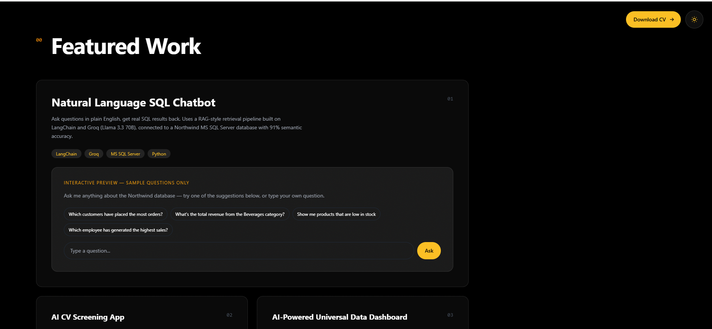

# Akshay Portfolio Site

A personal portfolio website built to showcase real, deployed AI and full-stack projects — not a generic template. Built with React, Vite, Tailwind CSS, and Framer Motion.

**Live site:** [https://akshay-portfolio-site-vert.vercel.app/)



## About

This site replaces the typical "purple gradient SaaS template" look with an editorial, asymmetric layout, a working dark/light theme toggle, glassmorphism project cards, and an interactive chatbot demo embedded directly on the page. Every project listed links to a real, live deployment or GitHub repository.

## Tech Stack

- **React** + **Vite** for the frontend
- **Tailwind CSS** for styling
- **Framer Motion** for animations and scroll-triggered reveals
- Deployed on **Vercel**, connected to this repo for automatic redeploys on push

## Features

- Editorial hero layout with a cursor-following glow effect
- Dark/light theme toggle with a fully separate color system for both modes
- Infinite-scrolling marquee of tools and technologies
- Glassmorphism project cards with hover-triggered glow accents
- An interactive chatbot demo (pre-set sample Q&A) showcasing the natural-language SQL chatbot project
- One-click resume download
- Fully responsive across desktop, tablet, and mobile

## Projects Featured

1. **Natural Language SQL Chatbot** — LangChain + Groq (Llama 3.3 70B) + RAG, 91% semantic SQL accuracy
2. **AI CV Screening App** — SAP CAP + Fiori Elements + Groq AI, deployed on SAP BTP Cloud Foundry
3. **AI-Powered Universal Data Dashboard** — Streamlit + Plotly + Groq, natural-language analysis over any uploaded dataset
4. **Brewnova** — Full-stack Django cafe ordering platform, deployed on PythonAnywhere
5. **GL Entry Approval Automation** — n8n Cloud workflow bridging SAP SuccessFactors and Sage X3

## Running Locally

```bash
git clone https://github.com/akshayy718/akshay-portfolio-site.git
cd akshay-portfolio-site
npm install
npm run dev
```

The site will be available at `http://localhost:5173`.

## Author

**Akshay Santhosh**
AI/ML Engineer and Automation Engineer
[GitHub](https://github.com/akshayy718) · [Portfolio](https://akshay-portfolio-site.vercel.app/)
